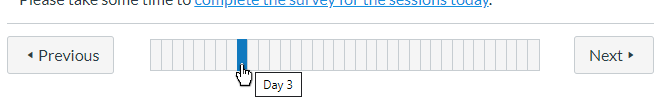

# canvas-where-am-I
Theme .js and .css to add within course navigation to Instructure Canvas *on the web*. Because the Canvas student app does not support ajax calls, it will not work on the student app. Does the following:

## Add Modules sub-menu
* Modules sub-menu item takes you to Modules page but hides other Modules

* For Pages and other items that are launched via the Modules page, the appropriate Module will be highlighted in the list below Modules (note that there is a switch: allowMultilineModuleTitles to specify whether to allow Module titles to wrap)

* Modules takes you to normal Modules view (unless it is the Home page)

## Add tiles at top of Modules tool (ONLY if Modules is set as home page):

* Tiles are generated by calling the Canvas api
* Added a drop-down arrow which gives you a quick link to the Module item (page, discussion, etc) - NOTE: only if showItemLinks==1
* Clicking the tile anywhere except the drop-down arrow takes you to the appropriate part of the Modules page

## Add progress bar below content (between Previous and Next buttons) as either:
* icon buttons for each item in a Module, linking to that item - rollover to see what that item is

* if insufficient space for buttonms, shows rectangle for each page, indicating position through Module. Tooltip shows title of item.

## Copy Previous and Next buttons from bottom of page to top (** Code curently comented out **)

* currently not working on every content type - see notes in code

# Installation
You'll need admin rights in a subaccount to be able to upload the canvas-where-am-I.css and canvas-where-am-I.js files into a Theme - see: https://community.canvaslms.com/docs/DOC-10862-4214724282 
**NOTE: Please read the 'Custom File Risks' section of the Canvas docs on theming to make sure you understand what you are doing**
1. Look at the various 'Configurable variables' at the top of the canvas-where-am-I.js - they are commented - and adjust as appropriate
2. Upload the canvas-where-am-I.css and canvas-where-am-I.js into the **CSS** and **JavaScript File** boxes for the **Canvas desktop application** only (it will not work on the student app).
3. If you would like your Home page to display the tiles for each Module, set the Modules page as your Home page.

# Contributing
I would be grateful for any help you can give with this. Some of the more obvious enhancements are in the 'Issues' for this repository. As well as these issues, there are some TODOs at the top of canvas-where-am-I.js.

# Development
If you are wanting to work on this script there are some supporting files that make development faster. To set this up you first need to install [npm](https://www.npmjs.com/get-npm) and [mkcert](https://github.com/FiloSottile/mkcert). Once installed run the initial setup of `mkcert`:

    mkcert -install

This will install a trusted root certificate which will mean your browser can load files from a local webserver over HTTPS without forcing you to accept the untrusted certificate first.

The next step is to generate a certificate to use with:

    mkcert localhost

Then install all the `npm` dependencies with:

    npm install

Then startup the local webserver that will response to requests.

    npm run start

There is then a file, [development.js](./development.js) that should be added to your theme as a JavaScript file which will dynamically add JS/CSS from your local webserver to Canvas. 

# Problems
Please report these as Issues and I will try and sort them out as soon as possible

# Caveat
This code relies heavily on the ids and classes of various elements in Canvas. As a result it is likley to break when Instructure make changes to the Canvas UI. I hope I am not being naive in thinking that these should be fairly simple to fix when necessary, particularly with help from others in the lovely Canvas community :)

